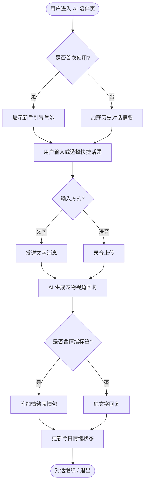
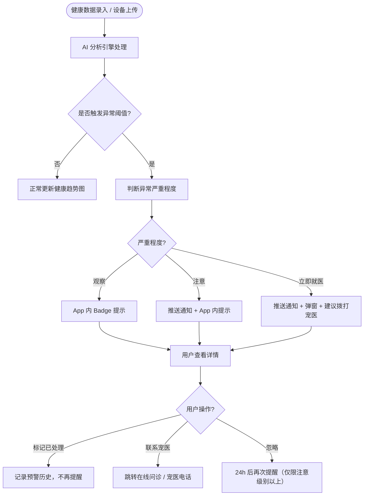
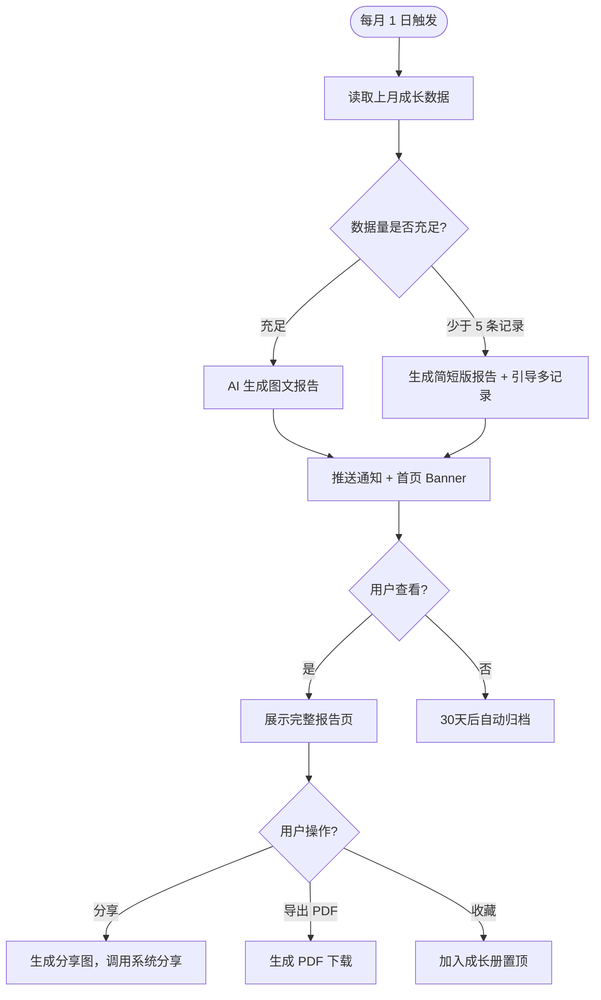
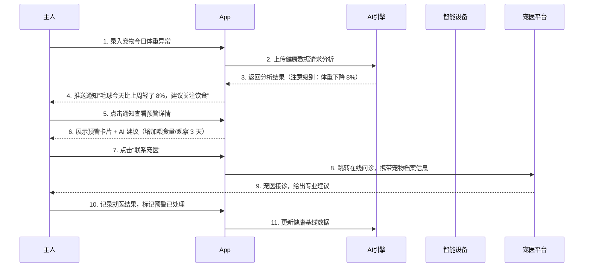
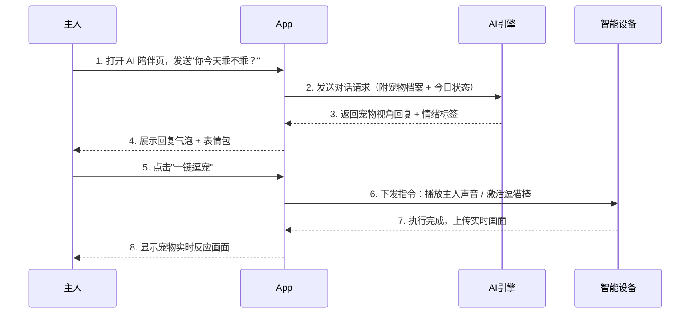

# PawMind — 懂你宠物的 AI 陪伴伙伴

## 📋 项目信息

| 字段 | 内容 |
|------|------|
| **产品名称** | PawMind |
| **版本定义** | v1.0 MVP |
| **文档负责人** | 待定 |
| **核心目标** | 让宠物主人在不在身边时也能"感知"到宠物状态，通过 AI 陪伴降低宠物分离焦虑，同时为主人提供健康预警与成长记录 |
| **全局原型** | 待补充 |

## 📝 版本记录

| 日期 | 版本号 | 修改内容 | 修改人 |
|------|--------|----------|--------|
| 2026-04-10 | v1.0 | 产品架构与 PRD 初稿 | AI 助手 |

---

## 产品定位

PawMind 是面向**城市养宠人群**的 AI 宠物陪伴 App，通过 AI 语音互动、行为分析和健康追踪，帮助主人在工作繁忙或出差期间仍能与宠物保持情感连接，并及时发现健康隐患。

**核心理念**：宠物不会说话，但 AI 可以帮它表达。

### 核心数据流

```
宠物行为/健康数据 → AI 分析引擎 → 情绪状态评估 → 陪伴互动 / 健康预警 → 主人感知 & 行动
```

每一步都有明确输入输出，数据闭环完整，不存在孤立功能。

---

## 一、产品架构总览

### 1.1 全局结构图（移动端 App）

```
┌─ 顶部导航栏 ─────────────────────────────────────────────┐
│  PawMind Logo      [宠物昵称/切换]      通知铃 🔔  头像   │
├────────────────────────────────────────────────────────┤
│                                                        │
│                    主内容区                             │
│  ┌─────────────────────────────────────────────────┐  │
│  │                                                 │  │
│  │   今日宠物状态卡 / AI 对话区 / 功能模块页面        │  │
│  │                                                 │  │
│  └─────────────────────────────────────────────────┘  │
│                                                        │
├────────────────────────────────────────────────────────┤
│ 底部 TabBar                                            │
│  🏠 首页    💬 AI陪伴    📊 健康    📸 成长册    👤 我   │
└────────────────────────────────────────────────────────┘
```

### 1.2 信息层级

```
用户账号（全局唯一，支持多宠物管理）
  └ 宠物档案（每只宠物独立档案）
      ├ 基础信息（品种 / 年龄 / 体重 / 疫苗记录）
      ├ AI 陪伴记录（对话历史 / 声音互动记录）
      ├ 健康数据（每日体征 / 异常预警 / 就医记录）
      ├ 成长日记（照片 / 视频 / 打卡里程碑）
      └ 行为分析（活跃度趋势 / 情绪曲线 / 饮食记录）
```

### 1.3 核心数据模型

```
宠物档案（PetProfile）（每用户可创建多只，按 pet_id 唯一）
  ├ 元数据（name / species / breed / birthday / avatar）
  ├ 健康基线（weight / normal_heart_rate / vaccine_list）
  ├ 关联关系（属于 user_id / 可被多设备访问）
  └ 状态信息（active / archived）

AI 对话记录（AIConversation）
  ├ session_id / pet_id / created_at
  ├ 消息列表（role: user|ai, content, timestamp）
  └ 情绪标签（joy / calm / anxious / excited）

健康日志（HealthLog）
  ├ log_id / pet_id / date
  ├ 体征数据（weight / appetite / activity_level）
  ├ 异常标记（is_alert / alert_type / severity）
  └ 关联就医记录（vet_visit_id）

关联关系说明：
  - 用户 1 对多 宠物档案
  - 宠物档案 1 对多 AI 对话记录
  - 宠物档案 1 对多 健康日志
  - 健康日志 → 删除宠物档案时级联归档（不物理删除）
```

---

## 二、用户与使用场景

### 2.1 典型用户画像

- **忙碌打工人（主力用户）** —— 25-35 岁城市白领，独居养宠，工作日在办公室超过 10 小时，核心焦虑是"宠物一个人在家怎么样"。
- **宠物焦虑型主人** —— 宠物有分离焦虑症状，需要每天多次远程互动，期望 AI 能替代自己陪伴宠物。
- **精细化养宠用户** —— 对宠物健康高度重视，希望记录每日体征、追踪健康趋势，提前发现异常。
- **新手宠主** —— 刚养宠，不了解宠物行为规律，需要 AI 解读宠物状态并给出饲养建议。

### 2.2 核心用户旅程图（User Journey Map）

| 阶段 | 用户触点 | 用户行为 | 痛点 / 情绪 | 我们的机会点 / 功能转化 |
|------|----------|----------|-------------|------------------------|
| **1. 发现** | 社交媒体 / 口碑推荐 | 看到"AI 陪宠物"的内容，点击了解 | 半信半疑，不知道 AI 能做什么 | 用"宠物情绪报告"截图快速传播，营造社交货币 |
| **2. 注册 & 建档** | App 首启动 | 填写宠物基础信息、上传照片 | 流程繁琐，担心信息没用 | 3 步建档，AI 立即生成第一份"宠物性格速写" |
| **3. 日常使用（上班途中）** | 通知推送 / App | 早上出门前看宠物的昨晚状态摘要 | 无法判断宠物睡得好不好 | AI 生成夜间活动摘要卡片，一句话说清状态 |
| **4. 在外陪伴（工作中）** | App / 智能设备 | 趁休息时间与宠物 AI 互动 | 想陪但没时间，愧疚感强 | "一键逗宠"：AI 驱动智能设备播放主人声音 |
| **5. 健康预警** | 推送通知 | 收到异常提醒，查看详情 | 不知道严不严重，慌乱 | AI 给出严重程度评级 + 是否需要就医的建议 |
| **6. 成长记录** | App / 分享 | 给宠物写日记、发朋友圈 | 照片散乱，没有成就感 | 自动生成月度成长报告，支持一键分享 |

---

## 三、核心页面

### 页面 1：首页 — 今日宠物状态

今日状态是用户每天打开 App 最先看到的页面，核心是让用户 5 秒内感知到宠物当前是否正常。

| 区域 | 内容 | 设计要点 |
|------|------|---------|
| **状态卡片** | 宠物头像 + 当前情绪状态（开心/平静/焦虑/活跃）+ AI 一句话摘要 | 情绪用颜色+图标表达，避免纯文字；摘要控制在 20 字内 |
| **快捷操作栏** | 一键逗宠 / 喂食提醒 / 查看直播 / 录语音 | 4 个高频操作，无需跳转，减少操作路径 |
| **今日健康指标** | 活动量 / 进食次数 / 饮水量（横向条状图） | 用"正常/偏低/偏高"文字标注，不让用户自己判断 |
| **AI 推送消息** | 当天 AI 主动推送的观察 & 建议（如"下午多喝水了，很棒"） | 每天最多 3 条，避免信息轰炸 |

### 页面 2：AI 陪伴对话

主人与"宠物 AI 分身"的对话页面，AI 以宠物视角回应，拉近情感距离。

| 区域 | 内容 | 设计要点 |
|------|------|---------|
| **对话主区** | 气泡式对话，AI 扮演宠物视角，附宠物表情包 | 宠物回复要简短有趣，避免 AI 感过强；表情包根据情绪自动匹配 |
| **快捷话题栏** | 今天乖不乖 / 想我吗 / 有没有捣乱 / 今天吃什么 | 降低对话门槛，特别是不知道说什么的用户 |
| **语音输入** | 支持录音，AI 合成"宠物回应"语音 | 语音交互情感更强；可选择宠物声音风格（萌/酷/沙雕） |
| **历史记录** | 按日期查看历史对话 | 强调"记忆感"，宠物 AI 会记住上次聊的内容 |

### 页面 3：健康管理

宠物全周期健康追踪，发现异常 → 预警 → 就医引导。

| 区域 | 内容 | 设计要点 |
|------|------|---------|
| **健康总览** | 近 7/30 天体重/活动量/饮食折线图 | 支持切换时间维度；异常点红色高亮 |
| **今日记录** | 快速录入体重/进食/异常症状 | 一键录入优先；录入后 AI 立即给反馈 |
| **预警列表** | 历史异常事件 + 严重程度标注 | 按严重程度分级：观察/注意/立即就医 |
| **宠医联系** | 合作宠医列表 + 在线问诊入口 | v1.0 只做入口，v1.5 深度合作 |

### 页面 4：成长册

宠物从小到大的成长记录，是用户最有情感价值的内容资产。

| 区域 | 内容 | 设计要点 |
|------|------|---------|
| **时间轴** | 按时间倒序展示照片/视频/日记 | 卡片式；支持标注标签（第一次 / 生病了 / 洗澡） |
| **里程碑** | 首打疫苗 / 第一次见主人 / 生日等关键节点 | 里程碑卡片视觉突出，可分享 |
| **月度报告** | AI 自动生成上月成长总结（图文混排） | 每月 1 日推送；内容有温度，不只是数据 |
| **分享导出** | 一键生成精美分享图 / 导出 PDF | 强社交属性，带品牌水印 |

### 页面 5：我的

用户账号、宠物档案管理、设备绑定、会员权益。

| 区域 | 内容 | 设计要点 |
|------|------|---------|
| **宠物档案管理** | 新增/切换/编辑宠物 | 支持多只宠物；切换简单快捷 |
| **设备绑定** | 智能摄像头 / 自动喂食器 / 逗猫棒 | 设备绑定引导要简单；设备状态实时显示 |
| **会员权益** | 免费版 vs 高级版功能对比 | 不要过早锁功能；v1.0 核心功能免费，AI 高级分析付费 |
| **设置** | 通知偏好 / 宠物资料 / 账号安全 | 常规设置；通知管理尤为重要（避免用户关推送） |

---

## 四、核心功能清单

### 4.1 宠物档案模块

| 功能点 | 描述 | 优先级 |
|--------|------|--------|
| 宠物建档 | 填写品种/年龄/体重/照片，3 步完成 | P0 |
| 多宠物管理 | 单账号支持绑定多只宠物，随时切换 | P0 |
| AI 性格速写 | 建档后 AI 根据品种+年龄生成性格分析 | P1 |
| 宠物信息编辑 | 随时更新体重、疫苗、照片等基础信息 | P0 |
| 宠物档案导出 | 导出完整健康档案（就医时有用） | P2 |

### 4.2 AI 陪伴模块

| 功能点 | 描述 | 优先级 |
|--------|------|--------|
| AI 对话（宠物视角） | AI 扮演宠物，以第一人称回应主人 | P0 |
| 语音互动 | 主人录音，AI 合成宠物语音回应 | P0 |
| 快捷话题 | 预设高频话题，一键发起对话 | P1 |
| 对话记忆 | AI 记住上次对话内容，有连续感 | P1 |
| 一键逗宠 | 通过智能设备远程播放声音/控制玩具 | P1 |
| 情绪标签 | AI 每次对话后生成宠物情绪标签 | P1 |

### 4.3 健康管理模块

| 功能点 | 描述 | 优先级 |
|--------|------|--------|
| 今日健康录入 | 快速记录体重/进食/活动量/症状 | P0 |
| 健康趋势图 | 展示近 7/30/90 天关键指标趋势 | P0 |
| 异常预警 | AI 检测到异常时主动推送提醒 | P0 |
| 预警严重程度分级 | 观察/注意/立即就医 三级分级 | P0 |
| 就医记录 | 记录每次就医时间/医院/诊断结果 | P1 |
| 疫苗提醒 | 根据疫苗记录自动提前提醒接种 | P1 |
| 在线问诊入口 | 连接宠医资源，支持图文问诊 | P2 |

### 4.4 成长记录模块

| 功能点 | 描述 | 优先级 |
|--------|------|--------|
| 照片/视频上传 | 随时记录宠物照片视频，附文字 | P0 |
| 时间轴展示 | 按时间倒序展示所有成长内容 | P0 |
| 里程碑标记 | 标注首次疫苗/生日/特殊事件等节点 | P1 |
| AI 月度报告 | 每月自动生成图文成长总结 | P1 |
| 一键分享图 | 生成精美分享图（带水印），发朋友圈 | P1 |
| 成长册导出 | 导出 PDF 版成长纪念册 | P2 |

### 4.5 设备联动模块

| 功能点 | 描述 | 优先级 |
|--------|------|--------|
| 智能摄像头绑定 | 绑定后实时查看宠物状态 | P1 |
| 自动喂食器控制 | 远程控制喂食时间和份量 | P1 |
| 设备状态监控 | 显示设备在线/离线/电量状态 | P1 |
| 行为检测联动 | 摄像头 AI 检测异常行为触发预警 | P2 |

---

## 五、详细方案设计

### 5.1 AI 陪伴 — 宠物视角对话

#### 1. 交互流程图



#### 2. 功能规则说明

**触发条件**
- 用户点击底部 TabBar「AI 陪伴」时进入
- 首页快捷操作「录语音」也直接跳转到语音输入状态

**交互与反馈**
- AI 回复时间 ≤ 2 秒；超过 2 秒显示"宠物正在思考…"动效
- 宠物回复字数控制在 30-60 字，口吻活泼
- 每条 AI 回复附带情绪标签（开心 / 想你 / 发呆 / 皮）
- 语音输入结束后自动识别文字并发送

**异常处理**
- **网络断开**：Toast 提示"网络不稳定，消息将在恢复后发送"，本地暂存
- **AI 响应超时（>5s）**：提示"宠物今天有点累，稍后再试试"，不显示 loading 超过 5 秒
- **语音识别失败**：提示"没有听清楚，换文字说说？"，引导切换输入方式

> 💡 原型链接：待补充

---

### 5.2 健康管理 — 异常预警推送

#### 1. 交互流程图



#### 2. 功能规则说明

**触发条件**
- 用户手动录入数据后立即分析
- 绑定设备的传感器数据每 30 分钟分析一次

**交互与反馈**
- 预警卡片显示：异常类型 / 当前数值 / 正常范围 / AI 解读（一句话）
- 严重程度用颜色区分：蓝（观察）/ 橙（注意）/ 红（立即就医）
- 每个预警支持"标记已处理"，处理后从待处理列表移除

**异常处理**
- **推送未送达**：App 内弹出 Banner 提醒
- **用户关闭了通知权限**：进入健康页时显示提醒条，引导重新开启
- **多条同类预警合并**：同一天同一类异常只推送一次，避免骚扰

> 💡 原型链接：待补充

---

### 5.3 成长记录 — AI 月度报告生成

#### 1. 交互流程图



#### 2. 功能规则说明

**触发条件**
- 每月 1 日 9:00 自动生成并推送上月报告
- 用户也可在成长册页手动触发"生成本月速览"

**交互与反馈**
- 报告包含：月度高光照片（AI 选最佳 3 张）/ 健康数据摘要 / AI 情感总结段落
- 报告页可横向滑动浏览，类似杂志翻页感
- 分享图自动加品牌水印，水印不遮挡主要内容

**异常处理**
- **当月无照片记录**：生成纯文字版报告 + 提示"下月多拍点照片，让我帮你记录更多～"
- **AI 生成失败**：降级展示数据统计卡片，不显示 AI 文案
- **PDF 生成超时**：提示"正在生成，完成后将通知您"，后台异步完成

> 💡 原型链接：待补充

---

## 六、业务流程图

### 主链路：宠物异常检测 → 主人处理



### 辅助链路：AI 陪伴对话



---

## 七、异常与边界处理

| 异常场景 | 系统处理 / 提示文案 |
|----------|---------------------|
| **网络断开（AI 对话中）** | Toast："网络开小差了，消息已暂存，恢复后自动发送" |
| **宠物档案为空（首次使用）** | 全屏引导页：宠物插画 + "先来认识一下你的宠物吧～" + [开始建档] 按钮 |
| **健康数据为空** | 展示插画 + "还没有记录，今天就开始吧" + [记录今日健康] 按钮 |
| **成长册无内容** | 展示插画 + "快去记录第一个精彩瞬间" + [上传第一张照片] 按钮 |
| **AI 响应超时（>5s）** | 提示："宠物有点忙，稍后再试" + 重试按钮 |
| **设备离线** | 设备图标变灰 + 说明"设备暂时离线，请检查电源/网络" |
| **相册权限未授权** | 弹窗引导："需要相册权限才能记录成长瞬间" + [去授权] 按钮 |
| **通知权限未授权** | 进入首页时 Banner 提示："开启通知，第一时间收到宠物状态提醒" |
| **图片上传失败** | Toast + 本地缓存，下次联网自动重传 |
| **月度报告 AI 生成失败** | 降级展示数据卡片，不显示 AI 文案段落 |
| **删除宠物档案** | 强弹窗确认："删除后所有记录将无法恢复，确认删除？" |

**边界场景自查清单：**
- [x] 首次使用（空状态引导 — 全部页面覆盖）
- [x] 网络异常（断网/弱网）
- [x] 权限不足（相册/通知/位置）
- [x] 数据量为零（Empty State — 每个核心页面均设计）
- [x] 操作不可逆（删除宠物档案前确认）
- [x] AI 服务降级（AI 失败时保留基础功能正常使用）
- [ ] 并发多设备操作（v1.5 解决）

---

## 八、AI 能力定位

PawMind 的 AI 能力以"理解宠物状态、辅助主人感知"为核心，设计三个明确触点，避免 AI 泛化。

```
触点 1：宠物视角对话（对话级）
  - 能做：以宠物第一人称回应，生成符合宠物性格的对话
  - 上下文：宠物档案（品种/年龄/性格）+ 今日状态 + 历史对话摘要
  - 记忆管理：保留近 10 轮对话上下文；跨天自动生成摘要保留长期记忆

触点 2：健康异常检测（模块级）
  - 能做：检测体征异常、判断严重程度、给出行动建议
  - 上下文：宠物健康基线 + 近 30 天健康数据 + 品种特征库
  - 记忆管理：无状态分析，每次独立判断；历史预警存储在健康日志中

触点 3：成长报告生成（对象级）
  - 能做：读取月度数据，生成有温度的图文总结
  - 上下文：当月所有成长记录 + 健康数据 + 里程碑事件
  - 记忆管理：无状态生成，报告生成后独立存储
```

**AI 能力边界说明：**
- AI 对话不替代专业宠医建议；健康预警始终附带"如有疑虑请咨询宠医"声明
- 情绪分析基于行为数据推断，存在不确定性；界面用"看起来很开心"而非"当前状态：开心"
- 数据来源透明：所有 AI 分析结论均显示"基于近 X 天的记录"

---

## 九、竞品对比与差异化亮点

### 竞品格局

| 产品 | 定位 | 强项 | 弱项 |
|------|------|------|------|
| **宠物说** | 宠物社区 + 健康 | 社区活跃度高，内容丰富 | AI 功能薄弱，陪伴感不强 |
| **爱宠助手** | 健康记录工具 | 功能全，数据详细 | 交互冷、无情感连接 |
| **AI 宠物陪伴智能设备（如 Tomofun）** | 硬件 + 互动 | 实体互动感强 | 硬件门槛高，软件弱 |
| **微信/抖音宠物账号** | 内容消费 | 流量大，触达广 | 无个性化、无健康管理 |

### 差异化亮点

#### 亮点一：宠物 AI 分身，不只是问答机器人

> 现有产品的 AI 功能停留在知识问答层面，用户问"猫咪为什么叫"得到百科答案——这和养宠毫无情感关联。PawMind 的 AI 以**宠物本体视角**回应，让主人感受到"我的宠物在和我说话"。

- AI 根据宠物档案（品种、年龄、性格标签）定制独特的回话风格
- 跨天对话有记忆感："上次你说你昨晚没睡好，今天怎么样了？"
- 情绪状态随当天记录动态变化，不是固定脚本

#### 亮点二：健康预警 + 行动建议闭环，不只是数据展示

> 宠物健康 App 大多只是"记录工具"——主人填了数据，App 画个图表，然后就没了。遇到异常主人仍然不知道该怎么办，焦虑反而更强。

- AI 给出行动建议（观察/饮食调整/立即就医），不让主人自己判断
- 预警直连宠医问诊，从发现问题到获得建议一步到位
- 历史预警可回溯，帮助宠医了解宠物历史健康情况

#### 亮点三：AI 月度成长报告，宠物社交货币

> 宠物主人最愿意分享的不是数据，而是"有温度的故事"。月度报告不是数据汇总，而是 AI 用第一人称写给主人的"宠物自述"，天然具备分享冲动。

- AI 写作口吻：从宠物视角写"这个月发生的事"
- 自动挑选最佳照片，不需要主人手动整理
- 分享图精美，带品牌水印，实现口碑传播

---

## 十、设计原则

| 原则 | 说明 |
|------|------|
| **情感优先于功能** | 当功能和情感体验冲突时，优先保证情感连接感。例如：AI 回复宁可短一些、有趣一些，也不要长篇大论但冷冰冰 |
| **主人不应该做判断员** | 对于健康数据，产品永远给出"下一步行动"，而不是把原始数据扔给用户自己判断 |
| **宠物是主角，主人是感知者** | 所有内容的叙述主体是宠物，AI 帮宠物"发声"，主人是"观察和感知"的角色 |
| **陪伴轻触化** | 每次互动成本要低。用户上班很忙，陪伴行为应在 30 秒内完成；不设置繁重的打卡任务 |
| **降级而非崩溃** | AI 失败时必须保留基础功能；不因为 AI 服务不可用就让整个 App 无法正常使用 |

---

## 十一、技术要点（备忘）

- **AI 对话**：调用大语言模型 API（如 GPT-4o / 混元），Prompt 工程中注入宠物档案 + 今日状态 + 品种特征
- **情绪分析**：基于文本分类模型，对每轮对话打情绪标签；冷启动阶段可用规则 + 关键词
- **健康异常检测**：规则引擎为主（体重变化阈值 / 进食频次异常），后期引入时序异常检测模型
- **推送通知**：iOS APNs + Android FCM；预警推送走高优先级通道
- **图片存储**：CDN + OSS；成长册照片客户端压缩至 1MB 以内再上传
- **AI 月度报告**：异步生成，队列处理；生成完成后 webhook 通知 App 推送
- **设备联动**：MQTT 协议；兼容主流品牌智能设备（小米 / 希喂 / 猫猫机等）
- **隐私合规**：宠物数据不作商业用途；健康数据本地加密存储；遵循 GDPR/个保法
- **多端同步**：宠物档案和健康数据云端同步；AI 对话记录云端存储（付费用户无限制）

---

## 十二、未来演进规划

- **v1.0（当前）**：跑通"建档 → AI 对话 → 健康录入 → 成长记录"四大核心流程，验证 AI 陪伴的情感价值。
- **v1.5**：加入智能设备深度联动（摄像头实时 AI 行为分析），补充宠医在线问诊功能，引入付费会员体系（高级 AI 分析 + 无限对话历史）。
- **v2.0**：开放宠物社区（主人可分享宠物日记），引入 AI 宠物行为建议（基于视频分析），支持多人共养（多个家庭成员共同管理同一宠物档案）。

**待完成事项（v1.0 研发阶段）：**
- [ ] 完成宠物建档流程原型设计
- [ ] AI 对话 Prompt 工程调优（宠物口吻一致性测试）
- [ ] 健康异常阈值规则库建立（按品种分类）
- [ ] 月度报告 AI 文案风格校准
- [ ] 设备联动 MQTT 协议对接方案确认
- [ ] 通知权限引导文案 A/B 测试方案

---

## 附件

- [宠物品种特征数据库（待建立）]
- [健康异常阈值规则表（按品种 / 年龄分类）]
- [AI 对话 Prompt 规范文档]
- [用户调研访谈记录]

---

*文档版本：v1.0 | 更新日期：2026-04-10*
*更新内容：产品架构与 PRD 初稿，涵盖十二节完整结构，包含 AI 陪伴、健康管理、成长记录三大核心模块的完整方案设计*
