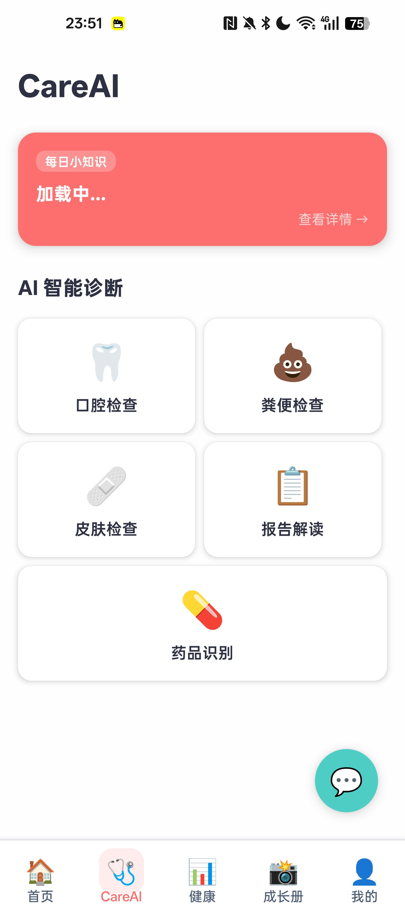
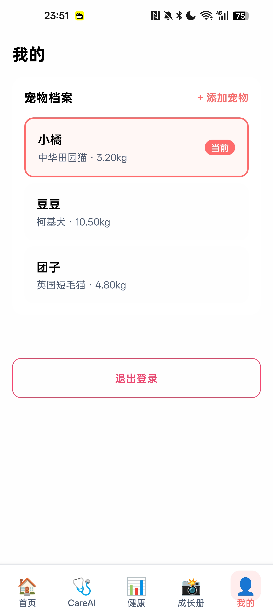

# PawMind 🐾

AI 驱动的宠物健康管理应用，帮助都市宠物主人通过智能设备数据采集、健康指标可视化、AI 辅助诊断和健康知识服务，全面掌握宠物健康状况。

> 让 AI 成为宠物的私人健康管家。

## 技术栈

- **移动端：** React Native + Expo + TypeScript + Zustand
- **后端：** NestJS + TypeORM + PostgreSQL + JWT 认证
- **共享包：** TypeScript 工具库
- **Monorepo：** npm workspaces

## 项目结构

```
├── apps/
│   ├── mobile/          # React Native Expo 移动应用
│   └── server/          # NestJS 后端服务
├── packages/
│   └── shared/          # 共享 TypeScript 工具
└── docs/                # 项目文档（PRD、架构、设计、指南）
```

## 快速开始

### 环境要求

- Node.js (支持 npm workspaces)
- PostgreSQL

### 安装依赖

```bash
npm install
```

### 启动开发

```bash
# 启动移动端
npm run mobile:start

# 启动后端服务
npm run server:dev
```

### 构建与测试

```bash
# 构建后端
npm run server:build

# 运行测试
npm test

# 测试覆盖率
npm run test:cov

# 代码检查
npm run lint
```

## 核心功能（v2.0）

- **宠物档案** — 3 步宠物建档，多宠管理
- **健康管理** — 多渠道数据采集，健康指标卡（24h/7天），数据可视化，异常预警
- **设备管理** — 智能设备绑定/配对，设备状态监控，展示型商城
- **健康档案** — 就诊记录 + 日常观察，支持打字/OCR/语音输入
- **电子疫苗本** — 条形码扫描添加疫苗，接种提醒
- **CareAI** — 健康知识问答，每日小知识，AI 拍照诊断（口腔/粪便/皮肤/报告/药品）
- **成长记录** — 照片/视频时间线，AI 月度成长报告
- **用户中心** — 账户管理与设置

## APP界面展示

| <br />首页：宠物状态卡片、功能快捷入口、小贴士、今天挑战（每天一个宠物互动活动） | <br />CareAI：AI问答、健康建议、口腔检查、粪便检查、皮肤检测、报告解读、药品识别 | <br />健康：当前健康指标（设备数据、手动录入）、健康档案（就医记录）、疫苗本、设备管理等 |
| ------------------------------------------------------------ | ------------------------------------------------------------ | ------------------------------------------------------------ |
| <br />成长册：成长记录（图、文、语音、视频） | <br />我的：宠物基础信息、账号信息、设置等 |                                                              |


## 文档

详细文档位于 `docs/` 目录：

- [产品需求文档 v2.0](docs/prd/v2.0-ai-health.md)
- [产品架构 v2.0](docs/architecture/product-architecture-v2.0.md)
- [技术设计 v2.0](docs/design/2026-04-13-v2.0-ai-health-design.md)
- [编码规范](docs/guides/coding-guidelines.md)
- [Git 工作流](docs/guides/git-workflow.md)
- [更新日志](docs/changelog/CHANGELOG.md)
