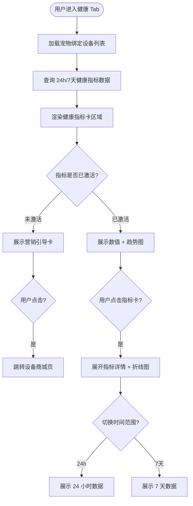
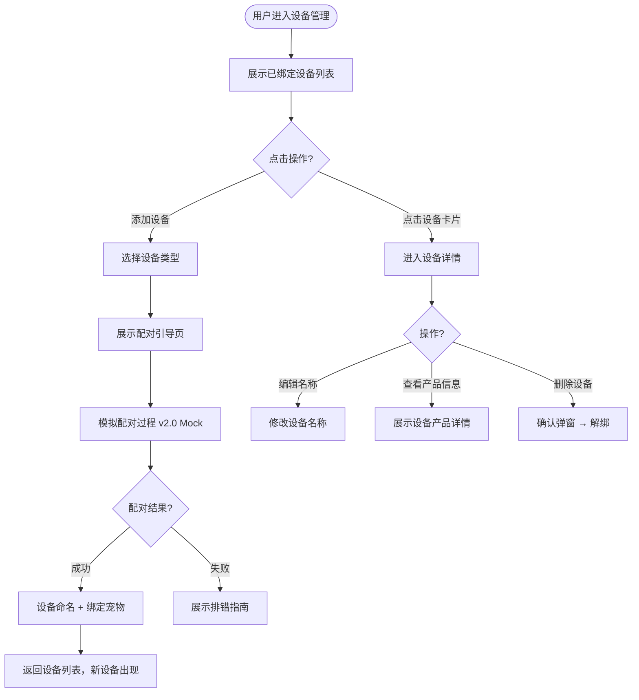
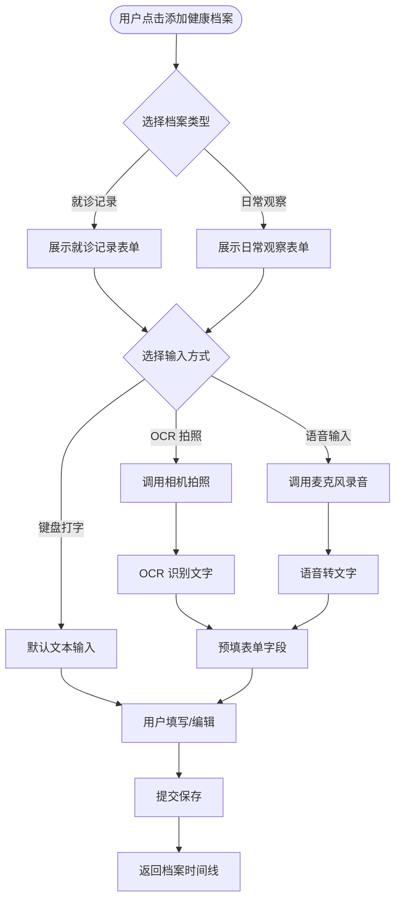
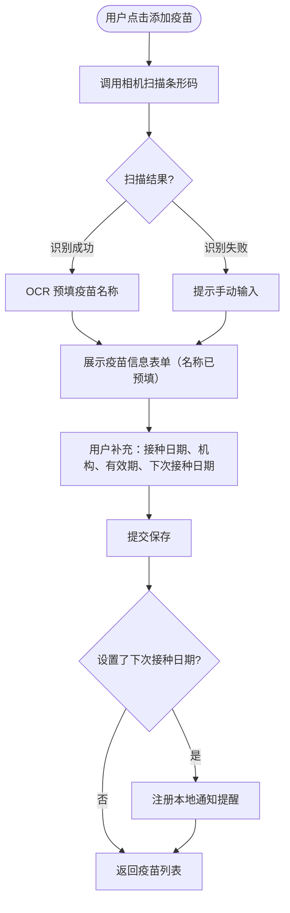
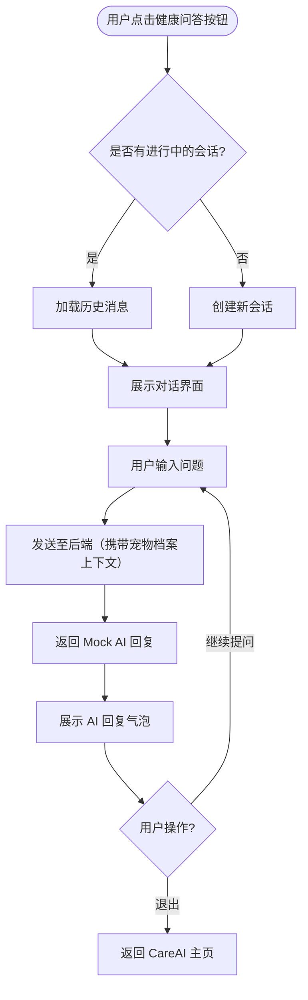
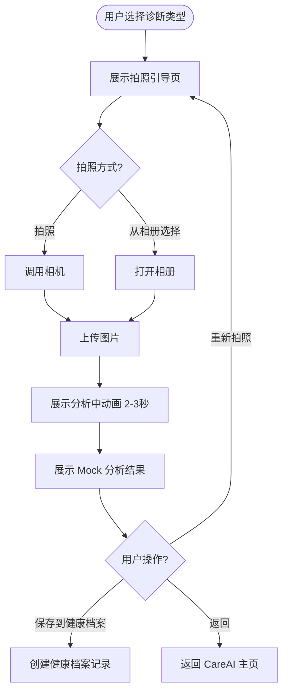

# PawMind v2.0 — AI 健康管理 产品需求文档

## 📋 项目信息

| 字段 | 内容 |
|------|------|
| **产品名称** | PawMind |
| **版本定义** | v2.0 AI 健康管理 |
| **文档负责人** | 待定 |
| **核心目标** | 将宠物健康管理从简单记录升级为多渠道数据采集+可视化+AI辅助诊断的完整健康平台，同时引入 CareAI 替换原 AI 陪伴模块，提供专业化的宠物健康智能服务 |
| **全局原型** | 待补充 |

## 📝 版本记录

| 日期 | 版本号 | 修改内容 | 修改人 |
|------|--------|----------|--------|
| 2026-04-13 | v2.0 | v2.0 PRD 初稿 | AI 助手 |

---

## 产品定位

PawMind v2.0 在 v1.0 「AI 宠物陪伴」的基础上，转向**AI 宠物健康管理平台**。核心变化：

1. **健康管理全面升级** — 从手动录入扩展为多渠道数据采集（硬件设备 + 手动录入），增加数据可视化、设备管理、电子疫苗本、健康档案等功能
2. **CareAI 替换 AI 陪伴** — 移除「宠物视角对话」，引入健康导向的 CareAI 模块，提供健康知识问答、每日小知识、AI 诊断功能

**核心理念**：让 AI 成为宠物的私人健康管家。

### 核心数据流

```
多渠道健康数据（设备/手动/拍照）→ 数据聚合与可视化 → AI 健康分析 → 指标预警 / 诊断报告 → 主人知情 & 行动
```

---

## 一、产品架构变更

### 1.1 底部导航调整

```
v1.0: 🏠 首页    💬 AI陪伴    📊 健康    📸 成长册    👤 我
v2.0: 🏠 首页    🩺 CareAI    📊 健康    📸 成长册    👤 我
```

### 1.2 信息层级（v2.0）

```
用户账号
  └ 宠物档案
      ├ 基础信息（品种 / 年龄 / 体重）
      ├ 绑定设备列表
      ├ 健康数据
      │   ├ 实时指标（设备上报）
      │   ├ 手动录入记录
      │   └ 指标可视化（24h / 7天）
      ├ 健康档案（就诊记录 / 日常观察）
      ├ 电子疫苗本
      ├ CareAI 记录
      │   ├ 健康问答历史
      │   └ AI 诊断报告
      ├ 成长日记（照片 / 视频 / 里程碑）
      └ 行为分析（v3.0+）
```

---

## 二、用户场景（v2.0 新增）

| 阶段 | 用户触点 | 用户行为 | 痛点 / 情绪 | 功能转化 |
|------|----------|----------|-------------|----------|
| **设备绑定** | 首次使用/设备管理 | 购买智能设备后希望绑定到App | 不知道哪些设备兼容，绑定流程复杂 | 展示型商城 + 配对引导 + 一键绑定 |
| **日常健康监测** | 健康Tab | 每天查看宠物各项健康指标 | 数据分散，无法一眼看出宠物状态 | 健康指标卡（24h/7天汇总） |
| **就诊记录** | 看完病后 | 想记录诊断结果和处方 | 手动打字太慢，报告拍照无法检索 | OCR/语音输入 + 结构化存储 |
| **疫苗管理** | 疫苗接种时 | 记录疫苗信息、查看接种计划 | 疫苗本容易丢，忘记下次接种时间 | 条形码扫描 + 接种提醒 |
| **健康问题咨询** | 发现异常时 | 想快速了解症状含义和应对方法 | 网上搜索信息杂乱不可靠 | CareAI 健康知识问答 |
| **AI 拍照诊断** | 发现异常时 | 拍照让 AI 初步分析口腔/皮肤/粪便 | 不确定是否需要就医 | AI 诊断拍照分析（Mock） |

---

## 三、核心功能清单

### 3.1 健康管理模块（升级）

| 功能点 | 描述 | 优先级 |
|--------|------|--------|
| 健康指标卡 | 展示 24h/7天核心健康指标汇总，设备驱动显示 | P0 |
| 指标数据可视化 | 各指标的趋势折线图，支持时间范围切换 | P0 |
| 设备驱动显示 | 已绑定设备的指标正常展示，未绑定的显示营销引导卡 | P0 |
| 手动录入指标 | 体重、饮食量、饮水量、体温、排便情况手动录入 | P0 |
| 设备数据接收 | 接收智能设备上报的健康数据（v2.0 Mock） | P1 |
| 异常预警 | 基于指标阈值检测异常并推送（保留 v1.0 功能） | P0 |

#### 指标与设备映射

| 指标 | 数据来源设备 | 手动可录 |
|------|------------|---------|
| 饮食量 | 智能喂食器 | ✅ |
| 饮水量 | 智能饮水机 | ✅ |
| 运动量/步数 | 智能项圈 | ❌ |
| 睡眠时长 | 智能项圈 | ❌ |
| 体温 | 智能项圈 | ✅ |
| 心率 | 智能项圈 | ❌ |
| 排便情况 | 智能猫砂盆 | ✅ |
| 体重 | 无（纯手动） | ✅ |

**未激活指标引导**：未绑定对应设备的指标卡显示为灰色锁定状态，文案「快来解锁{指标}监测，关注毛孩子的健康吧」，点击跳转设备商城页。

### 3.2 设备管理模块（新增）

| 功能点 | 描述 | 优先级 |
|--------|------|--------|
| 设备列表 | 展示已绑定设备卡片（名称、图标、电量、连接状态） | P0 |
| 添加/绑定设备 | 选择设备类型 → 配对引导 → 绑定确认（v2.0 Mock 配对） | P0 |
| 设备详情 | 设备名称（可编辑）、绑定时间、电量、网络状态、产品信息 | P0 |
| 删除设备 | 解绑设备，确认弹窗 | P0 |
| 设备商城 | 展示型商城，设备列表 + 参数介绍 + 外部购买链接 | P1 |
| 绑定指南 | 图文引导用户完成设备配对 | P1 |

### 3.3 健康档案模块（新增）

| 功能点 | 描述 | 优先级 |
|--------|------|--------|
| 添加就诊记录 | 就诊日期、医院名称、诊断结果、处方用药、医嘱、附件图片 | P0 |
| 添加日常观察 | 记录日期、观察内容（自由文本）、标签（精神状态/食欲/异常症状等） | P0 |
| 多输入方式 | 底部工具栏切换：键盘打字（默认）/ OCR 拍照识别 / 语音输入 | P0 |
| 档案时间线 | 按时间倒序展示所有健康档案 | P0 |
| 档案编辑/删除 | 编辑已有记录、删除（确认弹窗） | P1 |

### 3.4 电子疫苗本模块（新增）

| 功能点 | 描述 | 优先级 |
|--------|------|--------|
| 疫苗列表 | 按时间倒序展示已接种疫苗，待接种疫苗置顶提醒 | P0 |
| 添加疫苗记录 | 扫描条形码 → OCR 预填疫苗名称 → 手动补充接种日期、机构、有效期、下次接种日期 | P0 |
| 条形码扫描 | 调用相机扫描疫苗条形码，OCR 识别疫苗名称预填表单 | P0 |
| 接种提醒 | 基于下次接种日期推送本地通知 | P1 |
| 编辑/删除疫苗 | 编辑已有记录、删除（确认弹窗） | P1 |

### 3.5 CareAI 模块（替换原 AI 陪伴）

| 功能点 | 描述 | 优先级 |
|--------|------|--------|
| CareAI 主页 | 顶部每日小知识 + 中部 AI 诊断入口宫格 + 底部悬浮问答按钮 | P0 |
| 健康知识问答 | 对话式交互，用户提问宠物健康问题，AI 回复（v2.0 Mock） | P0 |
| 每日小知识 | 固定知识库每日推送一条，按分类组织，可回看历史 | P0 |
| AI 诊断 — 口腔检查 | 拍照引导 → 上传 → Mock 分析结果（口腔健康评分 + 问题提示） | P1 |
| AI 诊断 — 粪便检查 | 拍照引导 → 上传 → Mock 分析结果（形态/颜色分析 + 异常提示） | P1 |
| AI 诊断 — 皮肤检查 | 拍照引导 → 上传 → Mock 分析结果（皮肤状况评估 + 建议） | P1 |
| AI 诊断 — 报告解读 | 拍照引导 → 上传 → Mock 分析结果（关键指标解读 + 异常标注） | P1 |
| AI 诊断 — 药品识别 | 拍照引导 → 上传 → Mock 分析结果（药品信息 + 宠物用药注意事项） | P1 |
| 诊断结果保存 | 分析结果可保存到健康档案 | P1 |
| 免责声明 | 所有诊断结果页展示「AI 分析仅供参考，不替代专业诊断」 | P0 |

---

## 四、详细方案设计

### 4.1 健康管理 — 数据可视化

#### 交互流程图



#### 功能规则

- 健康指标卡区域位于健康 Tab 顶部，横向滑动展示所有指标
- 已激活指标显示：指标名称、当前值、单位、对比上一周期的变化（↑/↓/持平）
- 点击指标卡展开详情，展示时间范围内的折线趋势图
- 手动可录指标在详情页提供「手动录入」入口

### 4.2 设备管理 — 绑定流程

#### 交互流程图



### 4.3 健康档案 — 多输入方式

#### 交互流程图



### 4.4 电子疫苗本 — 条形码扫描

#### 交互流程图



### 4.5 CareAI — 健康知识问答

#### 交互流程图



#### 功能规则

- 对话界面类似聊天 UI，用户消息靠右，AI 回复靠左
- v2.0 Mock：预置常见宠物健康问题的回答模板，关键词匹配；匹配不到时返回「这个问题我还在学习中，建议咨询专业宠医哦」
- AI 服务层抽象为接口，后续替换真实 AI API 无需修改前端
- 自动携带当前宠物的品种、年龄、体重作为上下文

### 4.6 CareAI — AI 诊断

#### 统一交互流程



#### 各诊断类型差异

| 诊断类型 | 拍照引导 | Mock 结果示例 |
|---------|---------|-------------|
| 口腔检查 | 示例图引导拍摄口腔内部 | 口腔健康评分 85/100，牙齿状况良好，建议定期洁牙 |
| 粪便检查 | 引导拍摄粪便全貌 | 形态正常（布里斯托 4 型），颜色正常，未见异常 |
| 皮肤检查 | 引导拍摄皮肤患处 | 皮肤状况评估：轻微发红，建议观察 3 天，如持续请就医 |
| 报告解读 | 引导拍摄检验报告 | 检测到 5 项指标，其中 2 项偏高（标注），建议咨询宠医 |
| 药品识别 | 引导拍摄药品包装/说明书 | 药品名称、主要成分、宠物用药注意事项 |

#### 免责声明

所有诊断结果页底部固定展示：「⚠️ AI 分析仅供参考，不替代专业兽医诊断。如有疑虑，请及时就医。」

---

## 五、异常与边界处理

| 异常场景 | 系统处理 / 提示文案 |
|----------|---------------------|
| **设备配对失败** | 展示排错指南：检查设备电源 / 蓝牙开启 / 距离等 |
| **设备离线** | 设备卡片状态变灰，提示「设备已离线，请检查电源和网络」 |
| **条形码识别失败** | 提示「未能识别条形码，请手动输入疫苗名称」|
| **OCR 识别不准确** | 预填结果可编辑，提示「识别结果仅供参考，请确认后提交」 |
| **语音识别失败** | 提示「未能识别语音，请重试或切换为文字输入」 |
| **健康指标无数据** | 指标卡显示「暂无数据」+ 手动录入/绑定设备引导 |
| **CareAI Mock 匹配失败** | 返回「这个问题我还在学习中，建议咨询专业宠医哦」 |
| **诊断图片上传失败** | Toast 提示 + 重试按钮 |
| **相机/麦克风权限未授权** | 弹窗引导前往设置开启权限 |
| **疫苗提醒时间已过** | 疫苗列表标记「已过期未接种」，红色高亮提醒 |

---

## 六、AI 能力定位（v2.0）

```
触点 1：健康知识问答（对话级）— 替换原宠物视角对话
  - 能做：回答宠物健康相关问题，提供护理建议
  - 上下文：宠物档案（品种/年龄/体重）
  - v2.0：Mock 回复，预置知识库匹配
  - 预留：AI API 接口，后续接入大语言模型

触点 2：AI 拍照诊断（功能级）— 全新
  - 能做：分析宠物口腔/粪便/皮肤照片，解读检验报告，识别药品
  - v2.0：Mock 分析结果，UI 和流程完整
  - 预留：多模态 AI API 接口，后续接入图像分析模型

触点 3：健康异常检测（模块级）— 保留 v1.0
  - 能做：检测体征异常、判断严重程度、给出行动建议
  - 上下文：宠物健康基线 + 近 30 天健康数据 + 品种特征库

触点 4：成长报告生成（对象级）— 保留 v1.0
  - 能做：读取月度数据，生成有温度的图文总结
```

---

## 七、设计原则（v2.0 新增）

| 原则 | 说明 |
|------|------|
| **数据驱动决策** | 健康指标给出明确的正常/异常判断和行动建议，不让用户自己解读原始数据 |
| **设备即服务** | 未绑定设备 = 营销机会，用「解锁功能」的方式引导用户购买设备 |
| **AI 透明可信** | 所有 AI 分析结果附带免责声明和数据来源说明，不过度承诺 AI 能力 |
| **输入零门槛** | 提供多种输入方式（打字/OCR/语音/扫码），降低记录门槛 |
| 情感优先于功能 | 保留 v1.0 原则 |
| 降级而非崩溃 | 保留 v1.0 原则 |

---

## 八、版本演进规划（更新）

| 版本 | 目标 |
|------|------|
| **v1.0 MVP** | 建档 → AI 对话 → 健康录入 → 成长记录，验证 AI 陪伴情感价值 |
| **v2.0 AI 健康管理（当前）** | 健康管理升级（多渠道数据 + 可视化 + 设备管理 + 疫苗本 + 档案）+ CareAI（问答 + 诊断） |
| **v3.0** | 宠物社区 + AI 行为分析 + 多人共养 / 宠物交友 |

---

*文档版本：v2.0 | 更新日期：2026-04-13*
